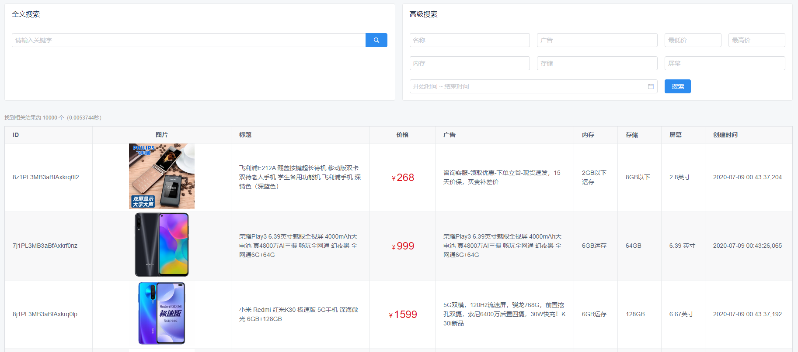
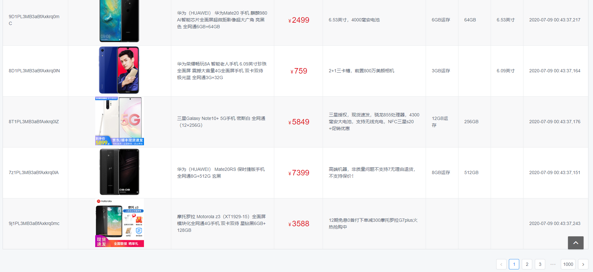
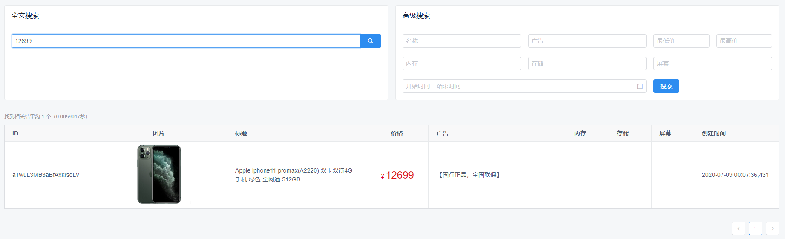
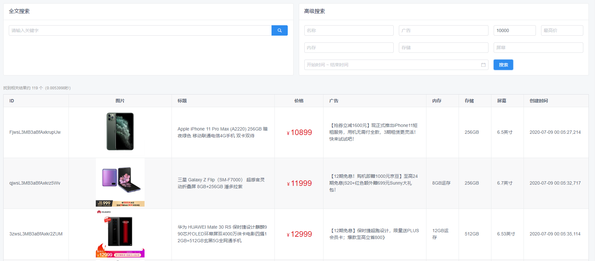
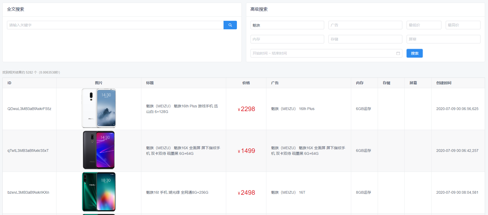

# Spring Boot 整合 Elasticsearch

2.3.1.RELEASE

## 测试数据下载地址

[phone-info.json](https://download.csdn.net/download/qq_28336351/12595861)

## 当前状态

* [x] 搭建项目（2020-06-25）
* [x] 设计测试模型（2020-07-04）
* [x] 抓取数据（2020-07-08）
* [x] 数据处理（2020-07-09）
* [x] 全文搜索接口（2020-07-11）
* [x] 高级搜索接口（2020-07-22）
* [x] 前端页面（2020-07-23）
* [x] 前端调用接口，实现搜索功能（2020-07-23）

## 效果截图

## 其他

还有一些问题，待优化！